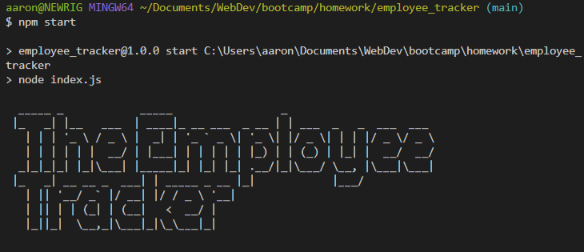
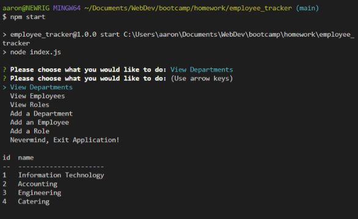

# The Employee Tracker App!

## Description
This is a simple command line application that allows a business to keep track of its orginizational structure! You can view company structure by Departments, Employees, and Roles. You can also add Departments, Employees, and Roles as well!

Please watch this instructional walkthrough video: https://youtu.be/s8dbDn2kYbo

## Table of Contents
- [Usage](#usage)
- [Credits](#credits)
- [License](#license)
 
## Usage
- Run `npm i` to install app dependencies
- Configure your data base with the `schema.sql` file located in the `/db` folder
- Seed your database with the `seeds.sql` file located in the `/db` folder
- Run `node index.js` or `npm start` in the terminal to start the application!
    
    
## License
License: MIT

## Built With Node.js And These Node Packages
* [MySQL](https://www.mysql.com/)
* [Express.js](https://expressjs.com/)
* [Node.js](https://nodejs.org/en/)
* [npmjs](https://docs.npmjs.com/)
* [inquirer](https://www.npmjs.com/package/inquirer)
* [figlet](https://www.npmjs.com/package/figlet)

## How to Contribute
If you would like to contribute to this project, please fork the project as needed.

## Questions
Have any questions for the author? Contact this author via [Email](mailto:aaronlucht@gmail.com)

Check out the author's [Github](https://github.com/d606n6k)

## Credits
    
Created by [d606n6k](https://github.com/d606n6k)
